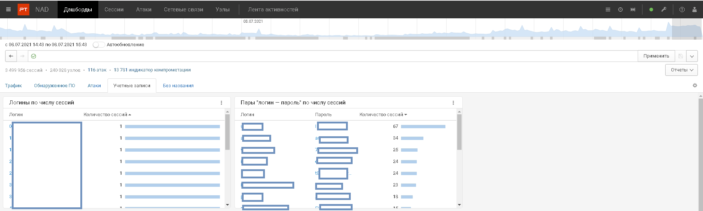
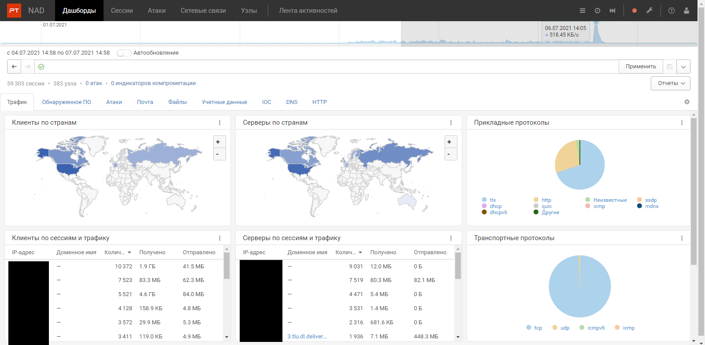

  ## PT NAD: обзор, основные возможности, сценарии применения, начало работы

  В данной статье мы рассмотрим основные возможности и назначение системы глубокого анализа трафика PT NAD от компании Positive Technologies, основные сценарии ее применения, а так же первые шаги после установки этого подукта, и немного затронем основной функционал.

  Аналитическое агентство Gartner включило решения класса NTA(Network traffic analyzer) вместе с EDR и SIEM в тройку средств, необходимых для построения SOC(Security operation center). Пионером NTA на отечественном рынке стала компания Positive Technologies с их системой глубокого анализа трафика, которая называется Network Attack Discovery.

  Решение PT NAD выявляет атаки не только на периметре сети, но и во внутреннем трафике. По модели OSI эта система работает от канального уровня L2 до уровня приложений L7. Для функционирования системы достаточно зеркалированной копии трафика( в том числе поддерживается шифрованный трафик), поэтому производительность сети не страдает при анализе. При этом, если использовать трафик как из внешней, так и из внутренней сети, то можно выявлять активность киберпреступников на разных этапах развития атаки.

  
  _Общая схема внедрения на примере PT NAD_

  ### PT NAD способен выявлять:
  1. __Угрозы  в зашифрованном трафике.__ Глубокая аналитика позволяет PT NAD с высокой точностью детектировать скрытые под TLS или кастомным протоколом вредоносные программы.
  2. __Горизонтальное перемещение злоумышленника.__ PT NAD обнаруживает попытки расширения присутствия злоумышленников в инфраструктуре, детектируя их действия: разведку, удаленное выполнение команд, атаки на Active Directory и Kerberos)
  3. __Хакерский инструментарий.__ Экспертный центр PT расследует сложные атаки, постоянно изучает новые угрозы и следит за деятельностью хакерских группировок. На основе этих знаний эксперты создают правила для PT NAD, которые выявляют применение всех популярных хакерских инструментов.
  4. __Эксплуатацию уязвимостей в сети.__ Собственная база уязвимостей постоянно пополняется информацией о новых уязвимостях, в том числе о тех, которые еще не попали в базу данных CVE. Это позволяет PT NAD оперативно выявлять попытки их эксплуатации.
  5. __Активность вредоносного ПО.__ PT NAD выявляет вирусное ПО по его сетевой активности. Это важно для локализации угрозы, поскольку вредоносное ПО легко сделать незаметным для антивирусных систем, но скрыть его сетевую активность труднее.
  6. __Признаки атак, не обнаруженных ранее.__ Как только база знаний PT NAD пополняется данными о новых киберугрозах, выполняется ретроспективный анализ трафика. Это позволяет максимально быстро обнаружить скрытое присутствие злоумышленника.
  7. __Сокрытие активности от средств защиты.__ PT NAD детектирует DNS-, HTTP-, SMTP- и ICMP-туннели, которые злоумышленники используют для кражи данных, связи вредоносного ПО с командным сервером и для сокрытия своей активности от средств защиты.
  8. __Автоматически сгенерированные домены.__ С помощью технологии машинного обучения PT NAD распознает доменные имена, созданные при помощи алгоритмов генерации доменов (DGA). Это помогает выявить вредоносное ПО, которое использует подобные домены для поддержания связи с командным сервером.
  9. __Нарушения регламентов ИБ.__ PT NAD помогает отслеживать словарные пароли, передачу учетных данных в незашифрованном виде, использование VPN-туннелей, Tor,   утилит для удаленного доступа, прокси, мессенджеров - всего того, что, как правило, запрещено политиками ИБ в крупных компаниях.  

  ### Основные сценарии применения:
  1. Контроль соблюдения регламентов ИБ
  2. Обнаружение атак внутри инфраструктуры и на периметре сети
  3. Расследование атак
  4. Охота на киберугрозы и уязвимости (threat hunting)  

  Подробнее про каждый из сценариев:  

  __Контроль соблюдения регламентов ИБ.__  
  Разбирая сетевые протоколы, PT NAD видит ошибки конфигурации устройств, передачу паролей в незашифрованном виде, применение инструментов сокрытия активности (Tor, VPN) и утилит для удалённого доступа: в крупных компаниях всё это часто запрещено внутренними политиками ИБ. Подобные нарушения упрощают задачу хакеров. Перехватив пароли пользователей и используя RAT, они могут быстро развить атаку, не вызывая подозрений у систем защиты.  

  __Обнаружение атак внутри инфраструктуры и на периметре сети__  
  PT NAD обнаруживает атаки с помощью технологии машинного обучения, глубокого анализа содержимого пакетов, ретроспективного анализа, собственных правил детектирования и индикаторов компрометации. Технология машинного обучения в PT NAD выявляет соединения с автоматически сгенерированными доменами (DGA-доменами). Злоумышленники используют их для обхода систем защиты, которые полагаются на репутационные списки: усовершенствованные вредоносные программы генерируют доменные имена командных серверов динамически с помощью специальных алгоритмов. PT NAD распознаёт соединения с DGA-доменами, которые свидетельствуют об активности вредоносных программ в сети. Правила и индикаторы еженедельно поставляются в продукт специалистами экспертного центра безопасности Positive Technologies. Ключевая информация об атаках отображается на панели мониторинга («дашборде»).

  __Расследование атак__  
  Чтобы дать возможность «раскрутить» цепочку атаки, понять, что предшествовало подозрительному событию, PT NAD хранит данные о сетевых взаимодействиях. Можно фильтровать их по 1200 параметрам и изучать подробности событий в прошлом. Для ещё более детального анализа PT NAD сохраняет записи «сырого» трафика, который можно выгружать в формате PCAP и включать в состав доказательной базы.

  __Охота на киберугрозы и уязвимости (threat hunting)__  
  Данные о сетевых взаимодействиях — полезный источник данных для проактивного поиска угроз, которые не обнаруживаются традиционными средствами безопасности. Оператор системы может проверять гипотезы о присутствии хакеров по трафику, выявлять скрытые угрозы и таким образом предотвращать развитие атаки.

  Теперь предлагаю перейти непосредственно к самому продукту и посмотреть, что можно (и нужно) сделать после того, как продукт установлен.

  ### После установки PT NAD необходимо:
  0. __Указать интерфейс, с которого необходимо захватывать трафик в NAD(можно несколько).__  Для этого нужно подключиться к устройству,на котором установлен продукт, открыть файл  /opt/ptsecurity/etc/ptdpi.settings.yaml, найти в нем строку capture_if: и после двоеточия ввести название интерфейса, с которого необходимо захватывать трафик. Если интерфейсов несколько, они указываеся в той же строке через пробелы и без знаков препинания.
  
  1. __Сменить стандартный пароль входа__
   После установки продукта вход в систему осуществляется через любой браузер. В адресной строке браузера необходимо ввести IP адрес устройства, на который установлен PT NAD и перейти.По умолчанию на вход в веб-итерфейс стоят стандартные логин и пароль для первого входа, но после этого настоятельно рекомендуется изменить пароль. Сделать это можно на вкладке Пользователь-> Смена пароля
   
  2. __Проверить автообновление базы знаний и то, что загружена их свежая версия.__ Для этого необходимо нажать кнопку Администрирование->Центр управления и проверить, что во вкладке Базы знаний включено автообновление правил и репутационных списков; так же в этой вкладке можно посмотреть версию и дату выпуска последнего загруженного пакета правил.
  
  3. __Прописать DC сервера__ Это необходио сделать потому, что есть группа правил от Positive Technologies, которые не могут работать без указания контроллеров домена(в интерфейсе они отображаются как правила с ошибками). Так же следует прописать "домашние"  сети, чтобы в сработках правильно отображалось группы хостов(Домашняя сеть - компьютеры, которые находятся во внутренней сети организации; Внешняя сеть - компьютеры из внешней сети; DC сервера - контроллеры домена). Для того, чтобы это сделать, необходимо нажать кнопку Администрирование-> Группы узлов и портов и ввести соответствующие адреса и сети в строках, без знаков препинания и через пробелы.
  
  Для более глубокой настройки так же есть возможность прописать http, smtp sql, telnet и другие типы серверов, а так же некоторые типы конечных устройст, например, мобильные.
  4. __Прописать доверенные домены, чтобы не было ложных срабатываний DGA доменов.__ Делается это через меню Администрирование->DGA-домены. В поле Доверенные домены необходимо вписать домены, которым можно доверять, и нажать кнопку Сохранить.
  
  ### Начало работы
  После авторизации в веб-интерфейсе пользователь попадает на главную страницу с дашбордами. Здесь можно увидеть наглядную статистику по захваченному трафику, просмотреть соотношение прикладных протоколов, карточку атак и еще много чего.   Список доступных дашбордов ограничен, однако пользователь сам может создавать "доску" с необходимыми ему.
  
  Продукт имеет неплохой функционал, что называется, "из коробки": сразу после заведения трафика в интерфейсе можно посмотреть, например, учетные записи в открытом виде. Сделать это можно с помощью дашбордов "Логины по числу сессий" и "Пары "Логин-пароль" по числу сессий", причем, как следует из названия, во втором дашборде можно увидеть пароли от учетных данных, которые есть в сети.
  
  Так же из коробки работает функционал обнаружения атак на основе правил, написанных экспертами Positive Technologies, посмотреть их сработки можно на вкладке ___Атаки___. Это работает неплохо,  но для более правильного отображения в конкретной компании потребуется коррекция сработок и дополнительная настройка продукта.
  Далее поговорим про основной функционал продукта и пройдемся по интерфейсу продукта. В самом верху страницы располагается полоска с доступными вкладками(___Дашборды, Сессии, Атаки, Сетевые связи, Узлы и Лента активностей___) чуть ниже - шкала активности трафика за прошедшее время. С ее помощью можно выбирать период, за который необходимо отобразить трафик. Сразу под ней располагается строка для ввода фильтров, по которым можно выбрать отдельные сессии. На фильтрах подробно останавливаться не будем, это тема для отдельной статьи.  
  
  Перейдя на вкладку ___Сессии___, пользователь получит список всех сессий за выбранный период, в каждую из них можно "провалиться" и посмотреть по ней подробности, такие, как, например, ip адреса, порты и домены участников сессии, дата и время ее начала и окончания, а так же протоколы, по которым происходило данное соединение. Так же на этой вкладке можно увидеть сводную статистику по трафику, сколько было отправленое, сколько получено, общий объем, а так же среднюю скорость трафика.  
  
  На вкладке ___Атаки___ можно увидеть обнаруженные продуктом атаки на основе базы знания Positive Technologies. Есть возможность добавления собственных правил, в продукте поддерживается синтаксис Suricata.
  
  Следующая вкладка - ___Сетевые связи___ - отображает интерактивный граф, который показывает связи всех хостов сети. Узлы можно перетаскивать мышкой, сам граф масштабируется, так что пользователь имеет возможность максимально удобно и наглядно расположить топологию сети.
  
  Вкладки ___Узлы___ и ___Лента активностей___ были добавлены в новом обновлении. Перейдя на первую из них, пользователь попадает на страницу со списком всех узлов сети,информацией о группе каждого узла, его адрес, установленная ОС, типы входящего и исходящего трафика, а так же информация, когда был обнаружен узел и дата и время последней активности.
  
  Вторая же вкладка - Лента активностей -  собирает в одном месте список выявленных угроз, объединяет сообщения об аналогичных активностях в одно и дает возможность управлять ими. Можно отметить устранение проблемы или больше не отслеживать подобную активность. В актуальной на момент написания статьи версии продукта в Ленте появляются уведомления об использовании словарных паролей, о неизвестных DHCP серверах, которые могут быть поддельными, а так же уведомления о сработках пользовательских фильтров трафика, но разработчики обещают добавить намного больше типов уведомлений в новых версиях продукта.
  

### Выводы
Системы класса NTA могут быть крайне полезными для решения целого ряда задач информационной безопасности: от контроля выполнения регламентов до проведения расследований инцидентов. Популярных систем класса Endpoint Protection Platform (EPP), которые создавались во времена совершенного другого ландшафта угроз и были направлены в основном на предотвращение массовых атак, уже становится недостаточно. Эти решения не ориентированы на противодействие сложным и комплексным угрозам на конечных точках, что свидетельствует о необходимости дополнительных инвестиций в специализированные продукты класса Endpoint Detection and Response (EDR) для расширенного обнаружения на базе передовых технологий и последующего реагирования на найденные сложные угрозы. Таким образом, только совместное использование технологий NTA и EDR и баланса между собственной экспертизой и использованием сторонних сервисов позволит организациям добиться действительно высоких показателей защиты своих конечных устройств и тем самым повысить безопасность компании в целом в эпоху быстро растущего числа и сложности передовых угроз и целенаправленных атак.
