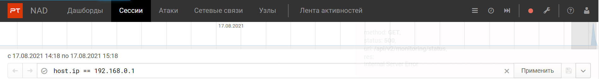
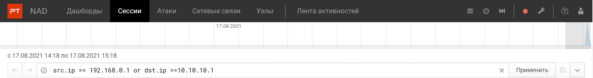
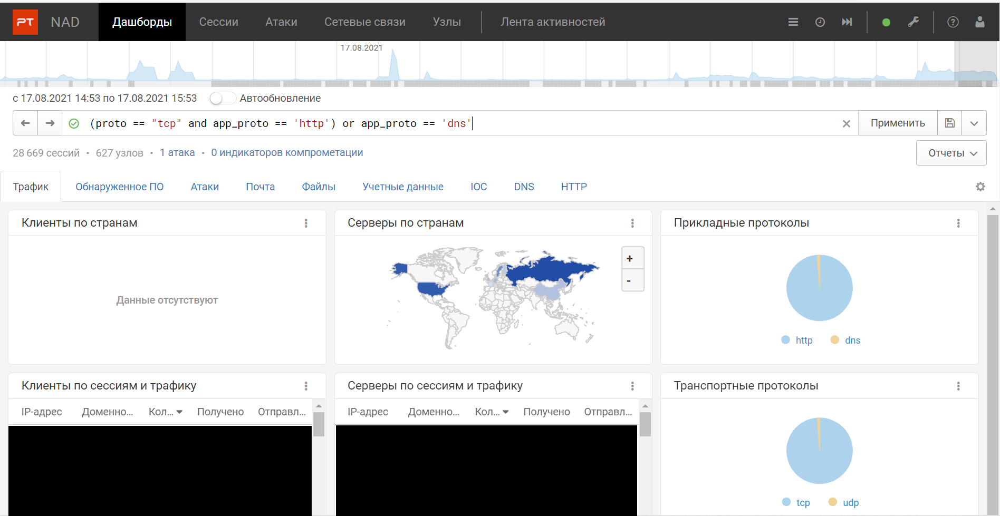
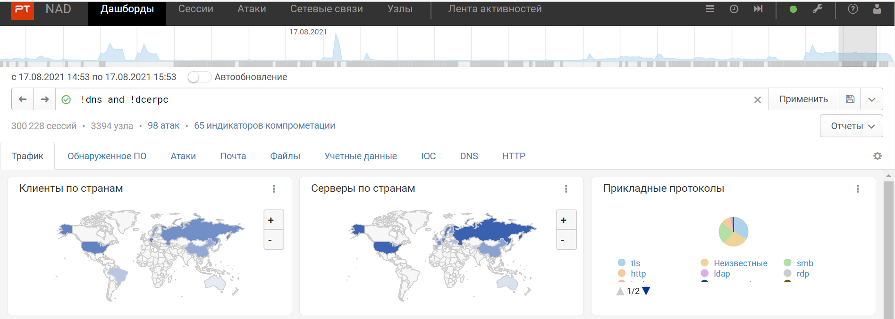
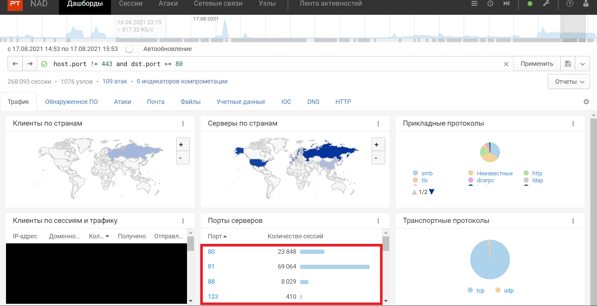
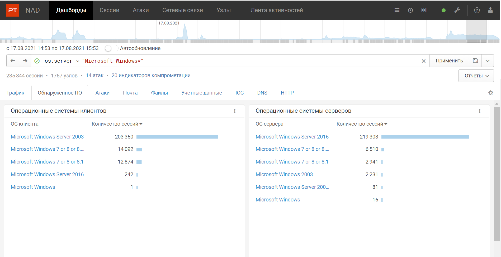
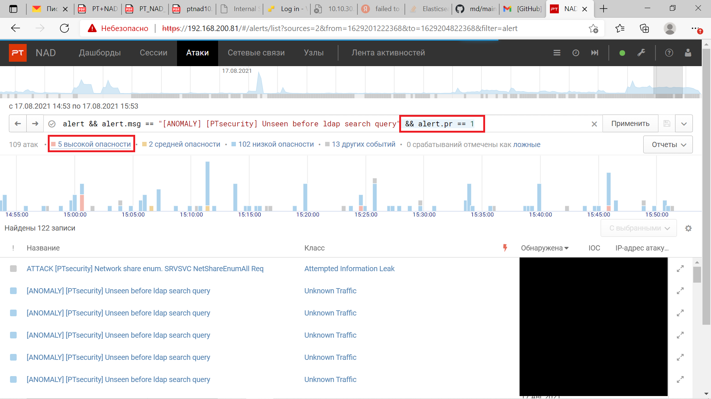

## PT NAD: работа с фильтрами

Приветствую всех на второй статье про систему глубокого анализа трафика от компании Positive Technologies - Network Attack Discovery. В прошлой статье я упоминал про фильтрацию сессий PT NAD, но не стал на этом останавливаться; в рамках же этой статьи предлагаю подробно рассмотреть данный функционал продукта.

PT Network Attack Discovery хранит 1200 параметров сессий без ограничений по времени, и для того, чтобы стало проще сортировать сессии по этим параметрам, разработчики сделали строку фильтрации. Примерами же хранимых параметров являются: ip адреса участников сессии, их сетевые группы, страны, порты отправителя и получателя, прикладной и транспортный протоколы и т.д. Используя данную технологию, оператор PT NAD может легко отсеять все ненужные ему в данный момент сетевые соединения, чтобы заострить свое внимание на самых важных.

### Фильтры
Синтаксис фильтров в PT NAD очень напоминает синтаксис Wireshark'а: указывается параметр, по которому необходимо произвести фильтрацию, далее указывается его значение через знак == (если параметр строковой, его необходимо указывать в кавычках).
  
Можно задать сразу несколько параметров, друг от друга они оделяются символами && или and(объединеный поиск по нескольким фильтрам, логическое И ) и || или or (поиск по одному из заданных фильтров, логическое ИЛИ).  
  
Такие выражения подчиняются правилам алгебры логики, поэтому можно объединять фильтры в скобки, но важно не ошибиться с правильным их объединением. Пример: FILTR1 && (FILTR2 or FILTR3) - будет произведен поиск по следующей логике: подходят сессию, которые попадают под FILTR1 и либо под FILTR2, либо FILTR3( или же подходят по всем трем фильтрам):  

 однако при использовании выражения (FILTR1 && FILTR2) or FILTR3 фильтрация уже будет происходить по правилу: подходят сессии, удовлетворяющие одновременно фильтрам FILTR1 и FILTR2, либо подходят сессии, удовлетворяющие FILTR3.  

На скриншоте на диграмме протоколов видно, что при переносе скобок появляются также сессии, происходившие по протоколу UDP.  
Нетрудно догадаться, что также присутствует логическое НЕ, задается с помощью восклицаетльного знака: по фильтру !FILTR1 будут отображены все сессии, которые не удовлетворяют фильтру FILTR1.

В данном примере я захотел посмотреть все сессии, которые происходили не по протоколам dns или dcerpc.  
Кроме знака равенства (==) также могут быть использованы знаки неравенства(!=), знаки "больше"(>) или "меньше"(<), а также "не больше"(<=) или "не меньше"(>=).  

А здесь я решил посмотреть те сессии, которые происходили не по протоколу https, но при этом порт, по которому они проходили, должен быть больше или равен 80.    
Одним из ощутимых удобств стала возможность использования в фильтрах регулярных выражений-формального язык поиска и осуществления манипуляций с подстроками в тексте, основанного на использовании метасимволов. Другими словами, система найдет все сессии, в указанном параметре которых есть заданная подстрока или часть какого то значения. Синтаксис следующий: если после подстроки может стоять только один символ, то следует поставить ?; если же символов может быть какое-то количество, заранее неизвестное пользователю, следует воспользоваться знаком *; стоит отметить, что при задании фильтра с помощью регулярного выражения знаки равенства становятся неприменимыми, и следует ииспользовать знак ~("тильда").   

  
Я захотел посмотреть все версии системы Microsoft Windows, которые используются в сети.  
Также, для простоты использования данной технологией, разработчики PT NAD добавили функцию добавления фильтра по щелчку мышкой: пользователь может кликнуть на параметр, который подсвечивается синим цветом, и он будет автоматически добавлен в строку задания фильтров в конец со знаком && перед фильтром.  
  
В этом примере я нажал на атаки высокой опасности и фильтр alert.pr == 1 автоматически добавился в строку фильтрации.  

Для более тонкой фильтрации полезно использовать несколько фильтров сразу, объединяя их, но тут самое главное - не запутаться в логике выражения. Итак, я  описал синтаксис фильтров системы глубокого анализа трафика PT Network Attack Discovery; сейчас же предлагаю перейти к небольшому примеру, который на практике показывает, для каких целей может использоваться данная технология и как с помощью нее можно расследовать сетевые атаки.

### Пример цепочки

План-капкан:

  - [x] рассказать кратко о фильтрах, по каким параметрам и зачем  
  - [x] Привести примеры для каждого параметрам  
  - [x] Так же стоит сказать про кликабельность  
  - [x] не забыть упомянуть про регулярные выражения  
  - [ ] показать пример расследования небольшой цепочки с помощью фильтров
  - [ ] заключение
